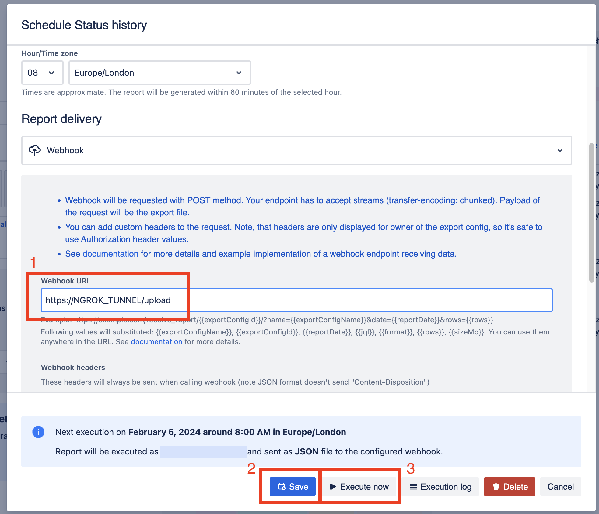

# advanced-export-examples

A set of examples related to [Advanced Export](https://marketplace.atlassian.com/apps/1217474/advanced-export?hosting=cloud&tab=overview) app for Atlassian Jira.

- [Documentation](https://docs.kanbanalytics.com/atlassian/advanced-export)
- [Atlassian Marketplace](https://marketplace.atlassian.com/apps/1217474/advanced-export?hosting=cloud&tab=overview)

## Webhooks

Advanced Export can send `POST` webhook calls when scheduled reports are executed.

Handling of these calls is presented in [app.ts](src/app.ts).

If the scheduled report exports a file (e.g. XLSX or CSV), the `POST` webook call will contain `Content-Disposition` header and the file will be attached to the call.
If the report is in `JSON` format, the call will contain JSON in the body (`Content-Type: application/json`) and will not contain `Content-Disposition`.

### How to run example server

This is a simple node.js server that can be used to test webhook calls.
To start the server, run:

```sh
npm run dev
```

or

```sh
npm run build && npm start
```

To be able to use the local server as a webhook URL in Advanced Export, you can use ngrok to expose the local server. The easiet way to do it is to run this in a separate terminal:

```sh
npm run ngrok
```

Once that's running, you can use the ngrok URL as a webhook URL in Advanced Export (see [Advanced Export documentation](https://docs.kanbanalytics.com/atlassian/advanced-export/scheduled-exports)).

`https://[NGROK_TUNNEL]/upload`

### How to use data from JSON report

The example app contains example code to calculate statistics for times spent in Statuses - see [stats.ts](src/stats.ts).

Provided:

- you have a webhook server running locally
- you've exposed local server via ngrok tunnel
- you have a report which exports "Status" column with history export enabled:


- you have a webhook URL (1) configured in the schedule for that report



You can save the schedule (2) and press Execute now (3).

The webhook will be called in several seconds, and you should see the output with calculated statistics, as in the example below:

Status | Avg | Median | 90%
---|---|---|---
In Progress | 1205d 8h 2m 28s | 887d 17h 17m 24s | 2379d 15h 2m 45s
Selected for Development | 5d 8h 26m 55s | 5d 8h 26m 55s | 5d 8h 26m 55s
Backlog | 433d 21h 20m 53s | 650d 9h 49m 39s | 650d 10h 3m 8s
To Do | 1660d 4h 17m 30s | 2372d 5h 52m 43s | 2372d 5h 52m 44s
Done | 1738d 10h 5m 56s | 2379d 15h 2m 45s | 2393d 16h 12m 45s

## Support

If you have any questions or need help, please contact us at:

- support@kanbanalytics.com
- [Service Desk](https://sngtec-dev.atlassian.net/servicedesk/customer/portal/1)
